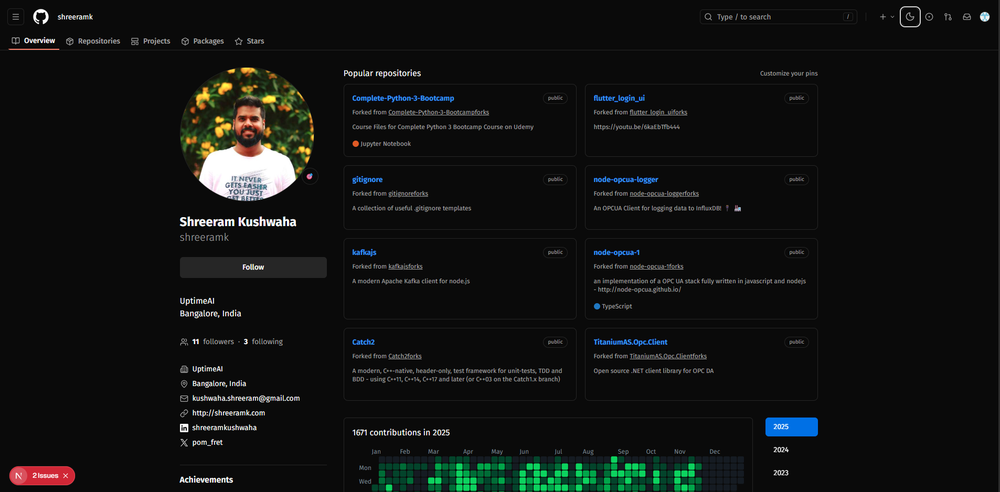
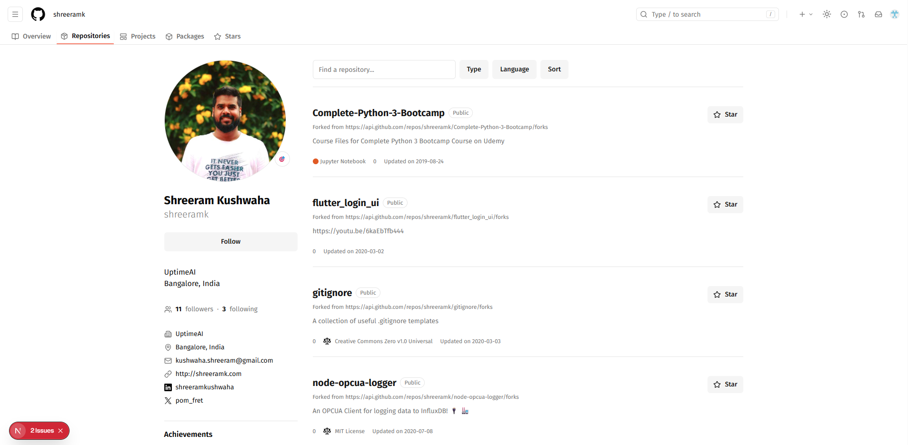
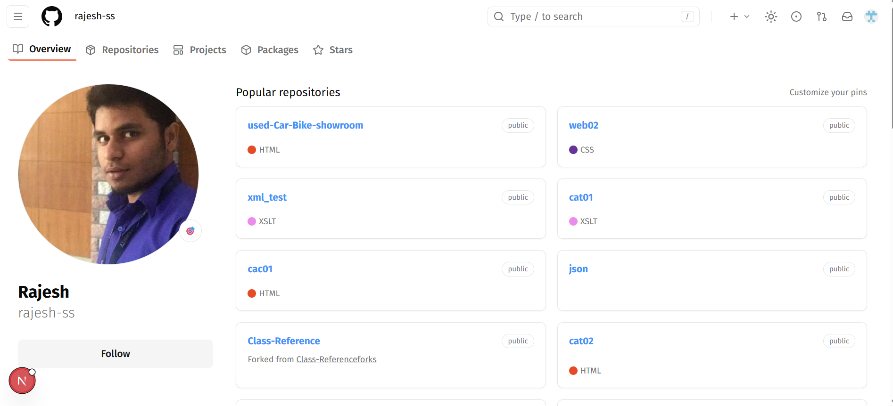

This is a [Next.js](https://nextjs.org) project bootstrapped with [`create-next-app`](https://nextjs.org/docs/app/api-reference/cli/create-next-app).

## Getting Started

First, run the development server:

```bash
npm run dev
# or
yarn dev
# or
pnpm dev
# or
bun dev
```

## 🚀 Features Implemented

1. **Light & Dark Theme Switching**

   The entire application supports smooth theme toggling with a GitHub-like UI experience.

2. **Dynamic User Details**

   User data is fetched dynamically based on the `userName` present in the URL path.
   Changing the path loads a new user’s details instantly.

3. **API Interceptor**

   A custom interceptor layer handles all API calls, including:

   - Attaching tokens where required
   - Managing errors
   - Consistent API behavior across the app

4. **Fallback Error Page**

   A fallback page is shown if something goes wrong—API failures, invalid user, or unexpected issues.

5. **Dynamic Contribution Graph by Year**

   The contributions heatmap updates whenever a different year is selected.
   All data is dynamically fetched via API.

6. **Year Persistence via Search Params**

   The selected year is stored in URL search params so it persists on refresh and can be shared via link.

7. **Dynamic Contribution Activity**

   The Activity Overview (Commits, PRs, Issues, Code Reviews) updates dynamically using GitHub API data.

8. **Server-Side Rendering for Token-Protected API Calls**

   Components that rely on authenticated API calls use SSR to ensure tokens never reach the client and remain secure.

9. **Dynamic Repositories Tab**

   Repositories list is fully dynamic, populated using the GitHub API with:

   - Repo details
   - Stars, forks
   - Languages
   - Updated timestamps

## 🖼️ Screenshots

Screenshots of key features are attached in the repository.

  
  


## 🛠️ Tech Stack

- Next.js (App Router)
- TypeScript
- TailwindCSS
- Recharts
- Next Themes
- GitHub REST API
- Server-Side Rendering (SSR)
